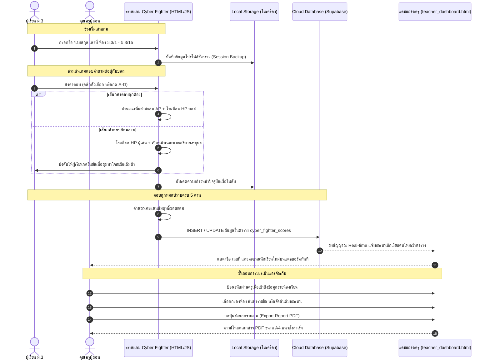

# Cyber Fighter: ศึกประลองวิชาดิจิทัล ม.3

เว็บแอปพลิเคชันสื่อการเรียนรู้สำหรับนักเรียนชั้นมัธยมศึกษาปีที่ 3 ในหน่วยการเรียนรู้เรื่อง **"การใช้เทคโนโลยีสารสนเทศอย่างปลอดภัยและมีความรับผิดชอบ"** โดยผสมผสานรูปแบบเกม RPG ย้อนยุคสไตล์ Sci-Fi/Retro เข้ากับเนื้อหาทางวิชาการเพื่อให้ผู้เรียนได้ฝึกฝน ทบทวนความรู้ และประลองฝีมือตอบคำถามต่อสู้กับบอสไวรัสคอมพิวเตอร์ประเภทต่าง ๆ พร้อมด้วยระบบแดชบอร์ดคุณครูเพื่อติดตามความก้าวหน้าและการเก็บคะแนนของนักเรียนแบบเรียลไทม์

---

## 💻 การประยุกต์ใช้เทคโนโลยีสารสนเทศ (Information Technology Application)

โครงการนี้ประยุกต์ใช้เทคโนโลยีสารสนเทศ (EdTech) เพื่อยกระดับการเรียนรู้ โดยจำแนกตามมาตรฐานวิชาการและวิศวกรรมคอมพิวเตอร์เป็น 2 ส่วนหลัก ดังนี้:

### 1. มิติด้านเนื้อหาการเรียนรู้ตามหลักสูตร ม.3
ตัวเกมและสื่อการเรียนรู้ถูกจัดรูปแบบเนื้อหาอ้างอิงจากหลักสูตรรายวิชาวิทยาการคำนวณ ม.3 เรื่องการใช้งานไอทีอย่างปลอดภัยและมีจริยธรรม โดยแบ่งประเด็นออกเป็นด่านประลองฝีมือ (Stages) ทั้งหมด 5 ด่าน:
*   **STAGE 1: การใช้เทคโนโลยีสารสนเทศระดับต่าง ๆ (สไลม์เทคโนโลยี)**
    *   *ระดับบุคคล:* การใช้งานเพื่อการเรียนรู้ สื่อสาร และพัฒนาทักษะเฉพาะตัว (เช่น การเข้าเรียนออนไลน์ การค้นคว้าข้อมูล)
    *   *ระดับองค์กร:* ระบบจัดการข้อมูลเพื่อประสิทธิภาพการทำงานร่วมกัน (เช่น ระบบ ERP การประชุมภายในผ่านระบบคลาวด์)
    *   *ระดับประเทศ:* โครงสร้างพื้นฐานทางเทคโนโลยีเพื่อประโยชน์สาธารณะและเศรษฐกิจ (เช่น ระบบยื่นภาษีออนไลน์ แอปพลิเคชันสุขภาพแห่งชาติ)
*   **STAGE 2: การทำธุรกรรมออนไลน์อย่างปลอดภัย (แฮกเกอร์จอมฉก)**
    *   การประเมินความเสี่ยงและมาตรการป้องกันในการใช้งาน e-Banking และ Mobile Banking
    *   การตั้งค่ารหัสผ่านที่ปลอดภัย (ความยาว 12–16 ตัวอักษร ผสมอักษรพิมพ์ใหญ่-พิมพ์เล็ก ตัวเลข และสัญลักษณ์พิเศษ)
    *   การกำหนดวงเงินทำรายการประจำวันเพื่อลดความเสียหายสูงสุดหากเกิดเหตุรั่วไหล
    *   การเปิดใช้งานการยืนยันตัวตนสองชั้น (2-Factor Authentication: 2FA) และกลไกรหัสผ่านครั้งเดียว (One-Time Password: OTP)
    *   การตระหนักรู้และหลีกเลี่ยงการเชื่อมต่อผ่าน Wi-Fi หรือเครื่องคอมพิวเตอร์สาธารณะที่ไม่เข้ารหัสข้อมูล
*   **STAGE 3: การซื้อสินค้าออนไลน์อย่างปลอดภัย (ปีศาจร้านค้าปลอม)**
    *   การสังเกตสัญลักษณ์ความปลอดภัย SSL/TLS ผ่านโปรโตคอล `https://` และสัญลักษณ์กุญแจสีเขียวบน URL bar
    *   การตรวจสอบและประเมินร้านค้านอกแพลตฟอร์ม (รีวิวผู้ใช้จริง, การจดทะเบียนพาณิชย์อิเล็กทรอนิกส์ DBD Registered)
    *   การวิเคราะห์กลโกงราคาตลาดที่ต่ำผิดปกติเพื่อจูงใจให้โอนเงินภายนอกระบบกลาง
    *   ขั้นตอนการเก็บหลักฐานการชำระเงินและสลิปธุรกรรมเพื่อยืนยันสิทธิ์หรือยื่นร้องเรียนเมื่อเกิดข้อพิพาท
*   **STAGE 4: การใช้งานอย่างมีความรับผิดชอบ 5 มิติ (จอมบิดเบือนไซเบอร์)**
    *   *ความรับผิดชอบต่อตนเอง:* การรักษารหัสผ่านเป็นความลับและการแสดงสิทธิ์ความเป็นเจ้าของผลงาน (การใส่ลายน้ำ ป้ายชื่อลิขสิทธิ์)
    *   *ความรับผิดชอบต่อผู้อื่น:* การเคารพสิทธิ์และลิขสิทธิ์ทรัพย์สินทางปัญญา ไม่แอบอ้างสวมสิทธิ์ และไม่สวมรอยใช้บัญชีผู้อื่น
    *   *ความรับผิดชอบต่อสังคม:* มารยาทเน็ตเวิร์ก การลดพฤติกรรมกลั่นแกล้งทางไซเบอร์ (Cyberbullying) และการประนีประนอม
    *   *ความรับผิดชอบทางจริยธรรม:* การประเมินความถูกต้องของข่าวสารก่อนกดแชร์หรือส่งต่อเพื่อไม่สร้างความเสียหายแก่ส่วนรวม
    *   *ความรับผิดชอบทางกฎหมาย:* การเข้าใจกฎระเบียบ พ.ร.บ. ว่าด้วยการกระทำความผิดเกี่ยวกับคอมพิวเตอร์ และการงดเผยแพร่เฟคนิวส์ (Fake News)
*   **STAGE 5: ด่านประมวลผลความรู้และสถานการณ์จำลอง (บอสใหญ่ไซเบอร์)**
    *   ข้อสอบสุ่มแบบสะสมรวมตั้งแต่ด่านที่ 1 ถึงด่านที่ 4 ร่วมกับข้อสอบสถานการณ์วิเคราะห์เชิงลึก (Scenarios) ที่ใกล้ตัวผู้เรียน เช่น ลิงก์ล็อกอินรับ Robux ฟรีใน Roblox, ลิงก์ปลอม Phishing ในแชทส่วนตัว, และการแอบอ้างภาพถ่ายลิขสิทธิ์ทำโครงงาน

### 2. มิติด้านการประยุกต์ใช้ซอฟต์แวร์และโครงสร้างทางวิศวกรรมเทคโนโลยี (System & Software Design)
*   **Frontend Engine:** พัฒนาด้วย HTML5, Vanilla CSS และ Pure JavaScript (ES6+) ทำให้เว็บดาวน์โหลดรวดเร็วและสามารถทำงานแบบ Standalone ได้โดยไม่มี Dependency ของเฟรมเวิร์กภายนอกมารบกวน
*   **Real-time Cloud Database Integration:** ใช้บริการคลาวด์ฐานข้อมูลแบบ Serverless ของ Supabase สำหรับเก็บคะแนนนักเรียน ม.3 ทุกห้องเรียน มีการส่งผ่านข้อมูลแบบ JSON และใช้การส่งผ่านแบบเรียลไทม์ผ่าน API
*   **Session Management & Cache Resilience:** นำ API พื้นฐานของเว็บเบราว์เซอร์อย่าง Local Storage มาประยุกต์ใช้บันทึกตำแหน่งข้อสอบ ด่านปัจจุบัน และข้อมูลส่วนตัวของผู้ใช้ เพื่อให้สามารถกลับมาเล่นต่อจากจุดเดิมได้ทันทีหากเกิดกรณีปิดเบราว์เซอร์หรือเครื่องดับชั่วคราว
*   **Teacher Analytics & Reporting Systems:** แผงควบคุมคุณครูใช้สคริปต์กรองข้อมูลเชิงลึก (Filtering Algorithms) สำหรับวิเคราะห์ผลคะแนนเฉลี่ย คะแนนสอบสูงสุด แยกตามรายชื่อ ห้อง และเลขที่ และสามารถแปลงองค์ประกอบ HTML ของหน้ารายงานให้ออกมาเป็นไฟล์ PDF ได้ในตัวเครื่องผ่านไลบรารี `html2pdf.js`
*   **DevOps & Security Build Automation:** ใช้ Node.js ในการสร้างระบบบิลด์อัตโนมัติ เพื่อคัดลอกไฟล์คอมไพล์ HTML และฉีดค่าตัวแปรสภาพแวดล้อม (Environment Variables) จาก `.env` ลงในตัวแปร JavaScript ของระบบก่อนจำหน่ายไฟล์ไปยังโฟลเดอร์ `dist/` เพื่อความปลอดภัยจากการรั่วไหลของข้อมูล API Keys บนโค้ดต้นฉบับ

---

## 📁 ไฟล์สำคัญในระบบ

| ไฟล์ / โฟลเดอร์ | รายละเอียดหน้าที่และเทคโนโลยีที่ใช้ |
| --- | --- |
| `index.html` | ประตูหน้าหลักของพอร์ทัล ออกแบบสไตล์ Neon Glassmorphism และระบบเคลื่อนที่ของอนุภาคฝุ่นแอนิเมชัน |
| `cyber_fighter.html` | อินเทอร์เฟซตัวเกมหลัก ประกอบด้วย SVG Sprites, ระบบลูปการต่อสู้ (Combat Loop), หน้าต่างเฉลยเหตุผล และโมดูลเชื่อมต่อ Supabase |
| `game_questions.js` | แหล่งรวมคลังโจทย์ 75 ข้อ และชุดข้อมูลสถานการณ์จำลอง (Student Scenarios) มีการจำแนกระดับความคิดตาม Bloom's Taxonomy |
| `teacher_dashboard.html` | หน้าบริหารจัดการคะแนนสำหรับคุณครู มีฟังก์ชันคัดกรองจัดกลุ่ม แสดงสถานะแบบเรียลไทม์ และระบบ Export เป็นรายงาน PDF |
| `instructions.html` | คู่มือและรายละเอียดฟังก์ชันต่าง ๆ ในระบบเกม รวมถึงวิธีการเข้าดูและจัดทำรายงานผลสัมฤทธิ์ |
| `presentation.html` | สไลด์สรุปเนื้อหาประกอบการบรรยายของผู้สอน ออกแบบให้โต้ตอบได้และควบคุมง่ายบนโปรเจกเตอร์หรือบอร์ดสัมผัส |
| `build.js` | สคริปต์สร้างไฟล์อัตโนมัติ (Build Script) สำหรับคอมไพล์ ซ่อนรหัสผ่านครู และฝัง API keys จากไฟล์ `.env` ลงในหน้า HTML ปลายทาง |
| `dist/` | โฟลเดอร์ปลายทางที่พร้อมสำหรับอัปโหลดเผยแพร่ (Production Build Directory) |

---

## 🛠️ โครงสร้างและการอธิบายโค้ดทุกส่วนอย่างละเอียด (Detailed Source Code Explanations)

เพื่อให้ผู้พัฒนาหรือครูผู้สอนเข้าใจการทำงานเชิงลึก ด้านล่างนี้คือคำอธิบายสถาปัตยกรรมของโค้ดหลักในทุก ๆ ไฟล์ของโครงการ:

### 1. พอร์ทัลเข้าสู่ระบบ (`index.html`)
เป็นไฟล์พอร์ทัลหลักที่รวบรวมทางเข้าสื่อการสอน เกม แผงควบคุมครู และคู่มือ
*   **ระบบ CSS Grid & Flexbox:** ออกแบบโดยใช้ CSS Grid ในคลาส `.portal-container` เพื่อจัดวางการ์ดทางเลือกให้แสดงผลแบบสมมาตร ปรับเปลี่ยนขนาดอัตโนมัติตามหน้าจอ (Responsive Layout)
*   **แอนิเมชัน Scanlines & Floating Glow bugs:** 
    *   ใช้ Pseudoelement `body::after` ร่วมกับ `linear-gradient` สร้างเส้นกราฟิกแบบทีวีย้อนยุคเคลื่อนที่ตลอดเวลาสร้างบรรยากาศแบบ Cyberpunk/Retro Game
    *   คลาส `.grid-glow-bug` ใช้คีย์เฟรม `@keyframes floatBug` เพื่อให้เกิดเอฟเฟกต์จุดเรืองแสงลอยรอบบอร์ดอย่างอิสระโดยการสุ่มค่า `animation-duration` ในแต่ละจุด
*   **Glassmorphism & Hover Glow Effects:** การ์ดแต่ละใบได้รับการกำหนดพื้นหลังเป็น `rgba(16, 20, 30, 0.7)` และใช้ `backdrop-filter: blur(10px)` เพื่อให้เห็นพื้นหลังลอยเด่น และจะเกิดการเรืองแสงโดยการปรับเปลี่ยนค่า `box-shadow` (เช่น `var(--glow-cyan)`) เมื่อผู้ใช้ชี้เมาส์ (Hover)

### 2. ตัวเกมประลองยุทธ์ (`cyber_fighter.html`)
เป็นศูนย์กลางการทำงานของตัวเกม มีความยาวและตรรกะซับซ้อนมากที่สุด ซึ่งมีฟังก์ชันหลักทำงานประสานกันดังนี้:

#### A. ตัวละครและบอสคอมพิวเตอร์กราฟิก (SVG Rendering)
*   ตัวละครและศัตรูทั้งหมดภายในด่าน ถูกออกแบบขึ้นมาโดยใช้กราฟิกแบบเวกเตอร์ (Scalable Vector Graphics: SVG) ฝังไว้ในตัวโค้ด HTML ทำให้ไม่ต้องการโหลดไฟล์ภาพนิ่งภายนอก ช่วยตัดปัญหาเรื่องภาพไม่แสดงผล
*   มีระบบแยกคลาสตัวละครชาย/หญิง `PLAYER_MODELS.male` / `PLAYER_MODELS.female` และบอสแต่ละด่านในโครงสร้าง `STAGE_CONFIG` (เช่น สไลม์ แฮกเกอร์ จอมบิดเบือน)

#### B. ตรรกะลูปเกมและระบบการต่อสู้ (Game State & Combat Logic)
*   **ระบบ HP (Hit Points) และ AP (Action Points):**
    *   ผู้เล่นและบอสแต่ละด่านจะมีคะแนนพลังชีวิต (HP) สูงสุดกำหนดไว้ตามความยากง่าย
    *   เมื่อผู้เรียนตอบถูก: จะคำนวณการโจมตีสร้างความเสียหายต่อบอส และเพิ่มพลังเวทมนตร์หรือค่าความโกรธ (AP) ขึ้น 15 หน่วย
    *   เมื่อสะสม AP ครบ 100 หน่วย ฟังก์ชันจะอนุญาตให้ปุ่มพิเศษ "ใช้สกิลโจมตีแรงพิเศษ" ทำงาน เพื่อสร้างความเสียหายแก่บอส 35% ทันทีโดยไม่ต้องตอบคำถามในข้อนั้น
*   **ระบบคอมโบสะสม (Combo Bonus):**
    *   เก็บสถิติจำนวนการตอบถูกติดต่อกันในตัวแปร JavaScript `comboCount`
    *   หากตอบถูกต่อเนื่อง คะแนนคอมโบจะเพิ่มขึ้นเรื่อย ๆ และจะช่วยเพิ่มพลังโจมตีพิเศษให้กับผู้เล่น แต่หากตอบผิด คะแนนคอมโบจะถูกล้างค่ากลับเป็น 0

#### C. ตรรกะการประมวลผลและการจัดชุดคำถาม (Question Selection Logic)
*   **การสุ่มโจทย์แบบรักษาสัดส่วนหัวข้อ:** เพื่อไม่ให้เด็กเล่นเจอโจทย์ซ้ำหรือยากเกินไป ระบบจะรวบรวมข้อสอบทั้งหมด 75 ข้อจาก `game_questions.js`
*   **การกระจายตามระดับ Bloom's Taxonomy:** ข้อสอบใน 25 ข้อที่สุ่มขึ้นมาเล่นจริงต่อรอบ จะถูกควบคุมสัดส่วนในฟังก์ชันสุ่มโจทย์ดังนี้:
    *   ด่าน 1 (ระดับการจำ/เข้าใจระดับพื้นฐาน) สุ่มเลือกมาจำนวน 3 ข้อ
    *   ด่าน 2 (ธุรกรรมปลอดภัย) สุ่มเลือกมาจำนวน 4 ข้อ
    *   ด่าน 3 (การช็อปปิ้งออนไลน์) สุ่มเลือกมาจำนวน 4 ข้อ
    *   ด่าน 4 (จรรยาบรรณและกฎหมาย) สุ่มเลือกมาจำนวน 4 ข้อ
    *   ด่าน 5 (บอสใหญ่ - ข้อสอบประมวลผลประยุกต์) สุ่มเลือกมาจำนวน 10 ข้อ
*   ทำให้ได้ปริมาณรวม 25 ข้อต่อรอบพอดี

#### D. ระบบเฉลยและป้อนกลับการเรียนรู้ (Feedback Loop & Modal Retry System)
*   **ฟังก์ชันการตรวจสอบคำตอบ:** เมื่อผู้ใช้ส่งคำตอบผ่านการกดปุ่มหน้าจอหรือการกดคีย์บอร์ด `A`-`D` ระบบจะประมวลผลผ่านอีเวนต์ลิสซึนเนอร์
*   **ระบบเฉลยทันทีหลังตอบผิด:** หากผู้เรียนเลือกคำตอบผิด หน้าต่างป๊อปอัปเฉลยเหตุผล (Explanation Modal) จะปรากฏตัวขึ้นมาพร้อมทั้งแสดงเครื่องหมายว่าตัวเลือกใดถูก พร้อมอธิบายรายละเอียดเสริมของข้อนั้น ๆ จากข้อมูลคลังคำถาม จากนั้นระบบจะบล็อกไม่ให้ก้าวข้ามข้อ และบังคับให้ผู้เรียนกดปุ่มเพื่อเริ่มทำข้อสอบข้อเดิมซ้ำใหม่อีกครั้งจนกว่าจะตอบถูก ทำให้ผู้เรียนเกิดกระบวนการเรียนรู้และจดจำสิ่งที่ทำผิดพลาดไปได้ทันที

#### E. การเชื่อมโยงบริการคลาวด์ภายนอกและการสำรองข้อมูล (Database & Browser API Integration)
*   **การเชื่อมต่อ Supabase SDK:** ฝังไลบรารีผ่าน CDN จากตัวส่งผ่าน JavaScript จากนั้นประมวลผลตรวจสอบการเชื่อมต่อผ่านฟังก์ชัน:
    ```javascript
    supabaseClient = supabase.createClient(SUPABASE_URL, SUPABASE_ANON_KEY);
    ```
    *(ในกรณีที่ URL/Key เป็นค่าว่าง ระบบจะแจ้งเตือนและสลับการทำงานไปเป็น Offline Local Storage Mode โดยอัตโนมัติเพื่อคงประสิทธิภาพการรันแอปพลิเคชัน)*
*   **การจัดเก็บลง Supabase Table:** เมื่อจบการต่อสู้ด่านที่ 5 ระบบจะส่งคำขอเขียนตารางฐานข้อมูลโดยสั่งสืบค้นและอัปโหลดคะแนนของนักเรียนเข้าคลาวด์ฐานข้อมูลแบบเรียลไทม์:
    *   ตารางเก็บคะแนนปลายทาง: `cyber_fighter_scores`
    *   ข้อมูลที่ส่งขึ้นคลาวด์: ชื่อจริง (`name`), นามสกุล (`surname`), เลขที่ (`student_number`), ห้องเรียน (`room`), คะแนนที่ทำได้จริงสูงสุด (`score`), และจำนวนครั้งที่พยายามทดสอบสะสม (`attempts`)
*   **ระบบสำรองข้อมูลฉุกเฉิน (Local Storage Caching):** ในช่วงที่ผู้เรียนทำการสืบค้นตอบโจทย์ ทุก ๆ ความก้าวหน้าจะถูกแปลงเป็นรูปข้อความ JSON และจัดเก็บไว้ผ่านคำสั่ง `localStorage.setItem('cyber_fighter_save', ...)` เสมอ ทำให้ถ้าหากเกิดไฟดับหรือคอมพิวเตอร์รีสตาร์ทกลางคัน นักเรียนจะไม่เสียความก้าวหน้าในการทำโจทย์และกลับมาทำต่อได้ทันที

### 3. คลังโจทย์และชุดคำถามระดับ ม.3 (`game_questions.js`)
ทำหน้าที่เป็นแหล่งสืบค้นคำถาม ตัวเลือก คำตอบ และเฉลยอธิบาย โดยถูกออกแบบแยกไฟล์เพื่อให้สะดวกสำหรับคุณครูที่ต้องการเข้ามาแก้ไข พัฒนา หรือเพิ่มเติมข้อสอบ
*   **การประกาศระดับความคิด (Bloom's Taxonomy Levels):**
    ```javascript
    const BLOOM_LEVELS = {
      REMEMBER: 'การจำ',
      UNDERSTAND: 'การเข้าใจ',
      APPLY: 'การประยุกต์ใช้'
    };
    ```
*   **โครงสร้างอาร์เรย์จัดเก็บคลังข้อสอบ (`QUESTION_BANK`):**
    รวบรวมข้อสอบ 75 ข้อแรกโดยแยกหมวดหมู่ตามด่านดัชนี (0-4) และจำแนกประเภทความรู้ชัดเจน ตัวอย่างข้อมูล:
    ```javascript
    [
      0, // ด่านที่ 0 (Stage 1)
      "การจำ", // ระดับ Bloom's Taxonomy
      "การใช้เทคโนโลยีสารสนเทศที่ช่วยให้ผู้คนสามารถเข้าถึงข้อมูลและค้นหาความรู้เพื่อฝึกทักษะใหม่ๆ ได้อย่างรวดเร็ว จัดเป็นการใช้งานเทคโนโลยีในระดับใด?",
      "ระดับบุคคล", // คำตอบที่ถูกต้อง (จะถูกจัดเป็น Choice ลำดับแรกใน Array เสมอเพื่อสะดวกต่อการคีย์ตรวจสอบ)
      ["ระดับประเทศ","ระดับองค์กร","ระดับสังคม"], // ตัวเลือกหลอก
      "เป็นการใช้เทคโนโลยีเพื่อการเรียนรู้และพัฒนาทักษะของผู้ใช้แต่ละคนโดยตรง" // คำอธิบายเฉลยเสริมหลังตอบผิด
    ]
    ```
*   **ระบบสลับตัวเลือกอัจฉริยะ (Shuffle Choices Utility):**
    เพื่อป้องกันไม่ให้เด็กจำตำแหน่งข้อคำตอบเฉลย ตัวแอปพลิเคชันหลักจะนำคำตอบที่ถูกต้องมาต่อกับตัวเลือกหลอก จากนั้นใช้ฟังก์ชันสลับที่ข้อมูลสไตล์สุ่ม (Shuffle) เพื่อกระจายคำตอบถูกไปยังตำแหน่งตัวเลือกที่ 1-4 แบบคาดเดาไม่ได้ก่อนนำขึ้นจอแสดงผล
*   **ชุดโจทย์สถานการณ์จำลองของนักเรียน (`STUDENT_SCENARIO_QUESTIONS`):**
    ชุดข้อสอบวิเคราะห์ปัญหาเหตุการณ์รอบตัวของเด็ก ๆ เพิ่มความเชื่อมโยงกับชีวิตจริง (เช่น ข้อสอบเรื่องลิงก์หลอกแฮกไอเทมเกมนอกระบบ, การขอรหัสผ่าน, หรือข่าวลือหยุดเรียนผ่านโซเชียลห้องเรียน)

### 4. แดชบอร์ดจัดการข้อมูลสำหรับคุณครู (`teacher_dashboard.html`)
แดชบอร์ดหลังบ้านช่วยอำนวยความสะดวกให้คุณครูผู้สอนติดตามความก้าวหน้า ตรวจสอบคะแนนเก็บ และประเมินวิเคราะห์ข้อมูลนักเรียนทุกคน
*   **ระบบล็อกอินความปลอดภัยผ่าน Passcode:** 
    *   ใช้แบบฟอร์มตรวจสอบความปลอดภัยเบื้องต้นเพื่อป้องกันไม่ให้นักเรียนแอบเข้ามาดูผลคะแนน
    *   รหัสผ่านจะถูกตั้งค่าและดึงมาจากตัวแปร `TEACHER_PASSCODE` ที่ถูกฉีดเข้ามาตอนคอมไพล์บิลด์ระบบ
*   **การสืบค้นข้อมูลแบบเรียลไทม์ (Real-time Database Subscription):**
    *   แดชบอร์ดใช้คุณสมบัติ Real-time Channels ของ Supabase เพื่อลงทะเบียนฟังเหตุการณ์ความเปลี่ยนแปลง (Subscription) ในตาราง `cyber_fighter_scores`
    *   เมื่อนักเรียนทำการกดส่งคะแนนจากเครื่องตนเองเสร็จสิ้น แถวข้อมูลคะแนนของนักเรียนคนดังกล่าวจะปรากฏและอัปเดตบนหน้าจอแดชบอร์ดของคุณครูทันทีโดยไม่ต้องทำการกดปุ่มรีเฟรชหน้าเว็บใหม่
*   **ระบบคัดกรองตัวกรองและจัดเรียงแบบไดนามิก (Dynamic Filters & Sorting):**
    *   *ระบบค้นหาแบบตอบสนอง (Interactive Search):* ตรวจสอบเหตุการณ์ `input` ในช่องค้นหาเพื่อสืบค้นเปรียบเทียบชื่อ นามสกุล หรือเลขที่ของเด็ก
    *   *ระบบกรองแยกห้องเรียน:* เมนูดรอปดาวน์สำหรับดึงคะแนนของนักเรียนแต่ละห้องเฉพาะเจาะจง (กรองตั้งแต่ชั้น ม.3/1 ถึง ม.3/15)
    *   *ระบบจัดเรียงคะแนนเก็บ:* คุณครูสามารถเลือกคลิกหัวตารางคะแนนเพื่อเรียงข้อมูลจากคะแนนสูงสุดไปต่ำสุด หรือเรียงตามเลขที่ห้องของนักเรียนได้อย่างง่ายดาย
*   **ระบบสร้างรายงานอิเล็กทรอนิกส์ (html2pdf.js integration):**
    *   บูรณาการไลบรารีภายนอกเพื่อสร้างรายงาน
    *   เมื่อคุณครูกดปุ่ม "ส่งออกเป็น PDF (Export Report)" ฟังก์ชันจาวาสคริปต์จะจัดรูปแบบหัวเอกสาร ใส่ชื่อรายวิชา และดึงข้อมูลตารางคะแนนที่กำลังแสดงผลอยู่ในขณะนั้นมาทำการส่งออกเป็นไฟล์เอกสาร PDF ขนาดกระดาษ A4 แนวตั้งอัตโนมัติ เพื่อนำไปปริ้นท์หรือเก็บเป็นหลักฐานรายงานการประเมินผลการศึกษาต่อโรงเรียน

### 5. สื่อการเรียนรู้แบบโต้ตอบ Roblox Style (`presentation.html`)
เป็นไฟล์สไลด์ประกอบการสอนของครูหน้าห้องเรียน เพื่อนำเด็กเข้าสู่หัวข้อก่อนให้แยกย้ายไปทดสอบเล่นเกม Cyber Fighter
*   **การออกแบบโครงสร้างสไลด์เป็นแบบบัตร (Slide Deck Architecture):**
    *   สไลด์แต่ละหน้าจะระบุอยู่ใน HTML element คลาส `.slide` และควบคุมการซ่อน/แสดงผลผ่านคลาส CSS `.active`
*   **ระบบนำเสนอควบคุมสไลด์ (Slides Navigation Control):**
    *   ผู้สอนสามารถใช้การสัมผัสหน้าจอ คลิกเลือกเมนูลูกศรซ้าย-ขวาบนจอคอมพิวเตอร์ หรือกดปุ่มคีย์บอร์ดลูกศรซ้าย `<-` / ลูกศรขวา `->` หรือปุ่ม `Spacebar` เพื่อควบคุมการเปลี่ยนภาพสไลด์ได้
*   **Interactive Minecraft/Roblox Graphic UI:** ใช้สีที่ฉูดฉาด การวางบล็อกแบบ 3 มิติ และสัญลักษณ์แบบพิกเซล เพื่อดึงความสนใจของนักเรียนวัยมัธยมต้นให้เกิดการจดจ่อกับเนื้อหาบนจอโปรเจกเตอร์

### 6. ระบบคอมไพล์และบิลด์อัตโนมัติ (`build.js`)
สคริปต์คอมไพล์รันบนระบบ Node.js เพื่อเตรียมโค้ดให้พร้อมใช้งานจริงและปกป้องคีย์สำคัญของระบบ
*   **โมดูลวิเคราะห์ไฟล์การตั้งค่า (Custom .env Parser):**
    *   ฟังก์ชันจะทำหน้าที่ตรวจสอบไฟล์ `.env` ในโฟลเดอร์หลัก หากพบข้อมูล จะดึงข้อมูลและจำแนกอาร์กิวเมนต์แบบ Key-Value ออกจากกัน และบันทึกเข้าไปยังตัวแปรระบบ `process.env` ชั่วคราว
*   **ระบบการประมวลผลไฟล์แบบวนซ้ำ (Recursive File Copier):**
    *   ตัวแอปพลิเคชันจะจำแนกรายชื่อโฟลเดอร์ที่ห้ามเผยแพร่ (Ignore List) เช่น `.git`, `node_modules`, `.env`, และไฟล์งานร่างตัวอย่าง
    *   จากนั้นจะสืบค้นไฟล์ในระบบทั้งหมดทีละรายการ หากเป็นไฟล์ทั่วไปจะคัดลอกลงโฟลเดอร์ `dist/` ตรง ๆ แต่ถ้าเป็นไฟล์นามสกุล `.html` จะส่งเข้าไปยังกระบวนการถัดไป
*   **ระบบสแกนและแทนที่คำจำเพาะ (Placeholder Injection Engine):**
    *   อ่านซอร์สโค้ดหน้า HTML แบบละเอียดเพื่อค้นหา Placeholders:
        *   `SUPABASE_URL_PLACEHOLDER` -> แทนที่ด้วยค่า `process.env.SUPABASE_URL`
        *   `SUPABASE_ANON_KEY_PLACEHOLDER` -> แทนที่ด้วยค่า `process.env.SUPABASE_ANON_KEY`
        *   `TEACHER_PASSCODE_PLACEHOLDER` -> แทนที่ด้วยค่า `process.env.TEACHER_PASSCODE` (หากตรวจไม่พบระบบจะใช้รหัสผ่านสำรอง `'teacher123'`)
    *   เขียนข้อมูลที่ผ่านการแทนค่าแล้วลงไปเป็นไฟล์ HTML ปลายทางในโฟลเดอร์ `dist/` ทำให้คีย์ความปลอดภัยถูกผูกเข้ากับระบบอย่างเป็นทางการโดยผู้พัฒนาไม่ต้องแก้โค้ดทีละบรรทัด

---

## 🕹️ แผนภาพการรับส่งข้อมูลและการทำงานของระบบ (System Workflow)



---

## 🛠️ ขั้นตอนการรันและการติดตั้งเพื่อพัฒนาต่อยอด

### 1. ความต้องการของระบบ (Prerequisites)
*   คอมพิวเตอร์ที่ติดตั้ง **Node.js** (เวอร์ชัน 16 ขึ้นไป) สำหรับรันสคริปต์คอมไพล์โครงการ

### 2. การกำหนดตัวแปรสภาพแวดล้อม (Environment Setup)
คัดลอกไฟล์ต้นแบบการตั้งค่าจาก `.env.example` ไปเป็นชื่อไฟล์จริงที่ชื่อ `.env` ในโฟลเดอร์หลัก:
```env
SUPABASE_URL=https://your-project.supabase.co
SUPABASE_ANON_KEY=your-anon-key
TEACHER_PASSCODE=รหัสผ่านเข้าหลังบ้านคุณครูที่คุณกำหนดเอง
```
*(หากยังไม่มีบัญชี Supabase หรือต้องการใช้แบบทดลองในเบราว์เซอร์ผ่านระบบ Offline Local Cache สามารถข้ามขั้นตอนนี้และสั่งบิลด์ได้ทันที)*

### 3. ขั้นตอนรันสคริปต์คอมไพล์แอปพลิเคชัน (Build Command)
สั่งรันสคริปต์คอมไพล์ระบบเพื่อสร้างผลลัพธ์ผ่านคำสั่ง:
```bash
npm run build
```
สคริปต์จะทำการสร้างโฟลเดอร์ปลายทางที่ชื่อ `dist/` ซึ่งเป็นผลลัพธ์ที่ได้รับการฉีดคีย์และรหัสผ่านจากไฟล์ `.env` ไปยัง Placeholder ภายในซอร์สโค้ดเรียบร้อยแล้ว คุณสามารถนำเนื้อหาภายในโฟลเดอร์ `dist/` นี้ไปโฮสต์ใช้งานบนระบบคลาวด์ เช่น Vercel, Netlify หรือระบบอื่น ๆ ได้ทันที

---

## 🛡️ มาตรการทางความปลอดภัยในการเผยแพร่ (Security Best Practices)
*   **Row-Level Security (RLS) บน Supabase:** สำหรับการใช้งานจริง ควรตั้งค่านโยบายของตาราง `cyber_fighter_scores` ใน Supabase ให้จำกัดสิทธิ์เฉพาะการเพิ่มข้อมูลใหม่ (`INSERT`) และดึงข้อมูล (`SELECT`) โดยใช้ `Anon Key` เท่านั้น ห้ามนำ `Service Role Key` มาประยุกต์ใช้เพื่อป้องกันการเจาะและโจรกรรมตารางข้อมูลจากบุคคลภายนอก
*   **ความปลอดภัยหลังบ้านครู:** รหัสผ่านในการเข้าดูผลคะแนน (`TEACHER_PASSCODE`) ได้รับการป้องกันในระดับนโยบายของระบบสร้างไฟล์ ซึ่งจะถูกฝังค่าลงในแดชบอร์ดอย่างปลอดภัยและมีระบบกรองความถูกต้องบนเว็บบราวเซอร์
